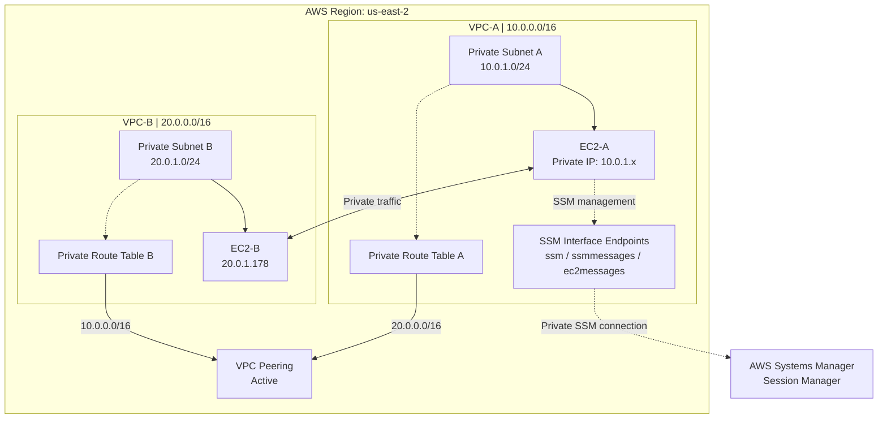

# AWS VPC Peering Project

## Project Overview

This project demonstrates how to establish secure network connectivity between two Amazon Virtual Private Clouds (VPCs) using VPC Peering.

## Objectives

- Create two separate VPCs.
- Configure VPC Peering between the VPCs.
- Update route tables to enable communication.
- Configure security groups to allow the required traffic.
- Test connectivity between resources in both VPCs.

## AWS Services Used

- Amazon VPC
- VPC Peering
- EC2 (if used in your lab)
- Route Tables
- Security Groups

## Architecture

Two VPCs are connected using a VPC Peering connection. Route tables are configured to allow traffic between the required networks.

## Implementation Steps

1. Create two VPCs with non-overlapping CIDR blocks.
2. Create subnets in both VPCs, if required.
3. Create a VPC Peering connection.
4. Accept the peering request.
5. Update the route tables on both sides.
6. Configure security groups to allow the required traffic.
7. Test connectivity between the VPCs.

## Testing and Validation

Connectivity was tested between the VPCs after configuring the peering connection and routing. Add your actual test results and screenshots here.

## Key Learnings

- VPC Peering configuration
- Route table management
- Security group configuration
- Private network connectivity
- AWS network troubleshooting

## Author

Deepika Vijayakumar

GitHub: https://github.com/deepikacloud-learner
